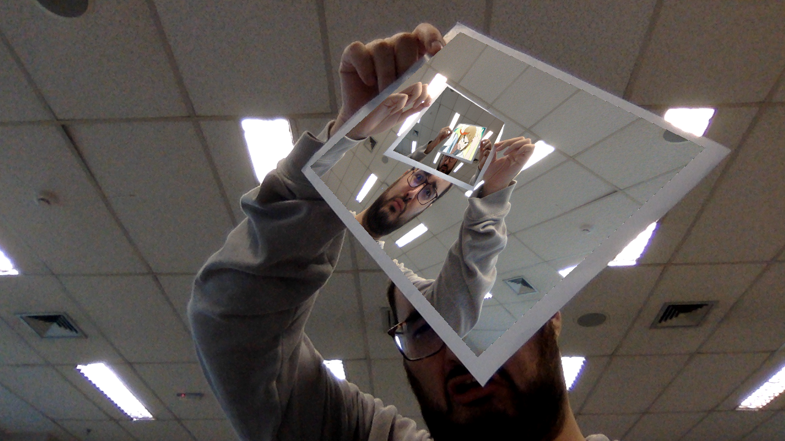

# Realidade Aumentada

#### Projeto para disciplina de Visão Computacional (Insper 2018)

## Resumo

Para o projeto do arco final da disciplina de Visão Computacional, era esperado o desenvolvimento de um programa capaz de perceber um tabuleiro _ArUco_ (ou _ChArUco_).

O programa (`main.py`) substitui o conteúdo deste tabuleiro por uma imagem escolhida, rotacionando-a, mudando sua angulação e fazendo qualquer outra transformação necessária para manter a imagem o mais realista possível no campo relativo a este tabuleiro.

## Uso

Na raíz do repositório existe uma `Pipfile`, a qual contem as dependências do projeto e pode ser utilizada em conjunto com o [pipenv](https://github.com/pypa/pipenv) para lidar com estas dependências.

Isso resolvido, basta executar o arquivo `main.py`. Adicionalmente, o mesmo possui 2 argumentos opcionais de linha de comando, o `--image` que aceita uma imagem para substituir o tabuleiro, o `--board` que aceita a imagem de um tabuleiro a ser definida como o padrão (deve ser identico ao utilizado) e o `--save` é uma flag se o programa deve salvar uma foto do executado (como no exemplo abaixo).

Exemplo de resultado esperado
